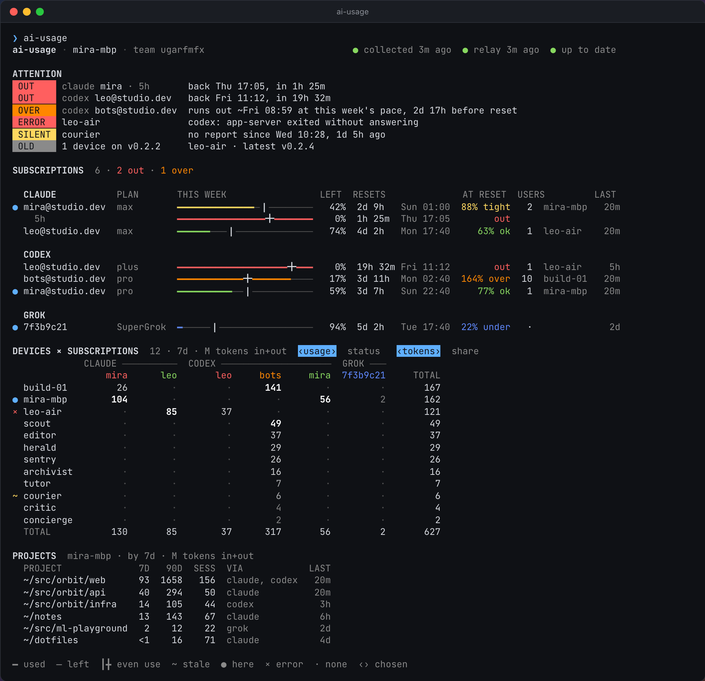

# ai-usage

ai-usage shows how much of your Claude Code, Codex, Grok, and Hermes quota you have used, and how many tokens went where. It can also show the same numbers for every machine in your team.

It is one small binary for macOS, Linux, and Windows. The system scheduler runs it every 15 minutes. Each run reads what those tools already record on disk, asks the installed tools for your account and quota, and exits. A run can also publish an encrypted summary for this machine to a small relay, and read the summaries of the other machines in your team.

<picture>
  <source media="(prefers-color-scheme: light)" srcset="docs/demo/team-light.png">
  
</picture>

That team is made up; [docs/demo](docs/demo) has its report and more pictures, and `ai-usage report --from docs/demo/team.json` shows it in your terminal. The same page as text, for another made-up team:

```
ai-usage · annbook · team qmvrtzpa                                  ● collected 7m ago  ● relay 7m ago  ● up to date

ATTENTION
 OUT    codex ann@acme.dev   back Fri 17:09, in 1d 23h
 OUT    claude ann · Fable   back Sun 01:00, in 3d 7h
 OVER   claude ann@acme.dev  runs out ~Thu 01:17 at this week's pace, 2d 23h before reset · reading 1d old
 OVER   codex sam@mail.test  runs out ~Sat 06:54 at this week's pace, 2d 13h before reset
 ERROR  Mac.localdomain      codex: app-server exited without answering
 OLD    2 devices on v1.4.0  Mac.localdomain, MacBook-Pro-Kim · latest v1.4.2

SUBSCRIPTIONS  7 · 2 out · 1 over · 3 no reading

  CLAUDE         PLAN        THIS WEEK                 LEFT  RESETS              AT RESET  USERS                LAST
● ann@acme.dev   max         ━━━━━━━━━╋━━━━━━────────  ~33%  3d 7h  Sun 01:00  ~174% over   2  annbook            7m
    Fable                    ━━━━━━━━━━━━╋━━━━━━━━━━━    0%  3d 7h  Sun 01:00         out
  kim@corp.test  max         ┈┈┈┈┈┈┈┈┈┈┈┈┈┈┈┈┈┈┈┈┈┈┈┈     ?                             —   1  Mac.localdomain    1h

  CODEX
● ann@acme.dev   pro         ━━━━━━━━━━━━━━━━━╋━━━━━━    0%  1d 23h Fri 17:09         out   2  annbook            1h
  sam@mail.test  prolite     ━━━━━━╋━━━──────────────   58%  5d 2h  Mon 20:12   157% over   1  MacBook-Pro-Kim    3h
● lee@corp.test  pro         ━━━┃────────────────────   88%  5d 22h Tue 16:30      81% ok  10  srv1              34m
  unknown                    ┈┈┈┈┈┈┈┈┈┈┈┈┈┈┈┈┈┈┈┈┈┈┈┈     ?                             —   1  Mac.localdomain   16m

  GROK
● a4c2e917       SuperGrok…  ┈┈┈┈┈┈┈┈┈┈┈┈┈┈┈┈┈┈┈┈┈┈┈┈     ?                             —   1  annbook           11h

DEVICES × SUBSCRIPTIONS  13 · 7d · M tokens in+out                   ‹usage›  status   ‹tokens›  share
                   CLAUDE ──────────  CODEX ─────────────────────────────  GROK ───  NO QUOTA
                        ann      kim       ann      sam      lee  unknown  a4c2e917    hermes     TOTAL
  srv1                    2        ·        12        ·      240        ·         ·         8       262
● annbook                19        ·       180        ·        ·        ·         3         ·       202
× Mac.localdomain         ·       10         ·        ·        ·       95         ·         ·       105
↓ MacBook-Pro-Kim         ·        ·         ·       60        ·        ·         ·         ·        60
  bot-a                   ·        ·         ·        ·       30        ·         ·         ·        30
  bot-b                   ·        ·         ·        ·       25        ·         ·         1        26
  bot-c                   ·        ·         ·        ·       16        ·         ·        <1        17
  bot-d                   ·        ·         ·        ·       12        ·         ·         ·        12
  bot-e                   ·        ·         ·        ·        9        ·         ·         ·         9
  bot-f                   ·        ·         ·        ·        7        ·         ·         ·         7
  bot-g                   ·        ·         ·        ·        4        ·         ·         ·         4
  bot-h                   ·        ·         ·        ·        2        ·         ·         ·         2
  bot-i                   ·        ·         ·        ·       <1        ·         ·         ·        <1
  TOTAL                  21       10       192       60      345       95         3        10       736

PROJECTS  annbook · by 7d · M tokens in+out
  PROJECT                                            7D  90D  SESS  VIA            LAST
  ~/src/acme/app                                    118  420    43  codex, claude    1h
  ~/Vault                                            43  130    56  codex            3h
  ~/src/site                                         18   62     6  codex            2d
  ~/src/ai-usage                                     11   11     3  claude, grok     7m
  ~/src/acme/os                                       4   12     3  claude, grok    11h
  ~/src/acme/relay                                    3    9     2  codex            1d
  ~/dotfiles                                          2    5     4  codex, claude    4d
  ~/scratch                                           1    3     5  claude           5d
  ~/src/acme/landing                                 <1    7     2  codex            6d
  ~/Library/…/Documents/Notes/Projects/2026          <1    2     1  claude           6d
  + 4 more

━ used  ─ left  ┃╋ even use  ┈ no reading  ~ stale  ? unknown  — no forecast  ● here  × error  ↓ old  · none  ‹› chosen
```

The header names this machine and the team, and says whether collection, the relay, and self-update are healthy; when one of them fails, its error is in ATTENTION. ATTENTION appears only when something is wrong: a subscription that is out, or will run out by its reset at its pace so far; a machine whose collector or one of its tools fails, or that has not reported for a day; machines on an older release; and a subscription past half its window that will be left mostly unused.

SUBSCRIPTIONS has one row per Claude, Codex, and Grok account, grouped by tool, the worst first. The bar is the weekly window: the heavy line is what has been used, and the tick how much would be used by now if the window were spent evenly. LEFT is what is left, RESETS when it resets, and AT RESET how full it will be then at its average pace since the window began: `over` at 100% or more, which means it runs out by its reset, `tight` from 85%, `ok` from 50%, and `under` below that. A window that limits the account more than the weekly one, such as a model's window or a full 5-hour window, gets an indented row of its own. `~` marks a reading over 6 hours old, unless the window is full, since a full window stays full until it resets. `?` marks an account with no reading, a window that has reset since it was read, or a Claude 5-hour or weekly window that a refused request did not read. USERS counts the machines that used the account in this window and names the busiest. Hermes is a tool, not a subscription: what it spends through a Codex or Grok login counts as that login's use.

DEVICES × SUBSCRIPTIONS is every machine against every subscription, in millions of input plus output tokens over the last 7 days, cache left out. NO QUOTA holds the tokens no subscription covers, such as Hermes on an API key. The section has a second view, status: a row per machine with its user, its release, how long ago it reported, the tools it reads, its tokens today and over 7, 30, and 90 days, and a note of what is wrong with it, such as an error, an update to install, or why it does not update itself. `--devices` prints that view. With only this machine, the section is USAGE instead: a row per subscription, with today, 7 days, 30 days, and 90 days. PROJECTS lists this machine's top projects over every account; `--projects` lists all of them. A dim legend at the bottom explains only the marks on screen.

The matrix shows accounts by short names: the part of an email before the `@`, or the first 8 characters of an id. `ai-usage alias` gives an account a name for the whole team; see [Teams](#teams).

When standard input and output are both terminals, `ai-usage` opens the same page as an interactive view. It scrolls, with the head of DEVICES kept at the top while its rows go by, and the matrix scrolls sideways; `s` switches DEVICES between the matrix and the status view, `p` picks the period (today, 7, 30, or 90 days), `%` shows each machine's percent of each subscription's tokens in the period, and in TOTAL of all the team's, `r` collects now, `?` lists every key, and `q` quits. Piped output, `--json`, `--plain`, and `TERM=dumb` print the page instead, and so does the installer's first run. The page is at its best at 120 to 160 columns; narrower, it drops columns in a fixed order, down to 80.

## Install

macOS and Linux:

```sh
curl -fsSL https://raw.githubusercontent.com/neoromantic/ai-usage/main/install.sh | sh
```

Windows, in PowerShell:

```powershell
irm https://raw.githubusercontent.com/neoromantic/ai-usage/main/install.ps1 | iex
```

Releases are built for amd64 and arm64 on each OS. The installer:

1. downloads the release file for your OS and CPU, and `checksums.txt` from the same release
2. checks the SHA-256 checksum
3. installs the binary into a folder on your `PATH` (see below), or to `%LOCALAPPDATA%\Programs\ai-usage\ai-usage.exe` on Windows, where it also adds that folder to your user `PATH`
4. saves the relay and joins the team, if you gave them
5. runs `ai-usage` once, which registers it with the scheduler and prints the report with a short guide under it

On macOS and Linux, an upgrade replaces the binary where it is: `~/.local/bin/ai-usage`, or the `ai-usage` found on `PATH` when you can write to its folder. A new install goes into the first of `~/.local/bin`, `~/bin`, `/opt/homebrew/bin`, and `/usr/local/bin` that is on your `PATH` and that you can write to, and never into a folder that belongs to another tool, such as `~/.cargo/bin`.

When none of them is, the binary goes into `~/.local/bin`, and the installer adds that folder to `PATH` in the profile of your login shell, the one `$SHELL` names:

| Shell | Profile |
| --- | --- |
| zsh | `~/.zshrc`, or `$ZDOTDIR/.zshrc` |
| bash on macOS | the first of `~/.bash_profile`, `~/.bash_login`, and `~/.profile` that exists, else a new `~/.bash_profile`; a terminal on macOS opens a login shell, which reads only that one |
| bash on Linux | `~/.bashrc` |
| fish | `~/.config/fish/conf.d/ai-usage.fish`, or the same under `$XDG_CONFIG_HOME` |
| sh, dash, ash, ksh, or mksh | `~/.profile` |
| another shell, such as tcsh or nushell | none; the installer prints the line to add |

It adds a block that starts with `# Added by the ai-usage installer`, once: running the installer again adds nothing. A new terminal finds `ai-usage` by name; in the terminal you installed from, use the full path the installer prints. With `AI_USAGE_NO_MODIFY_PATH=1`, and as root under `sudo`, where `HOME` can still be yours, it leaves profiles alone and prints the line to add.

The installer replaces only its own binary. Another program named `ai-usage`, or a link such as Homebrew's or a version manager's shim, stays where it is, and the installer picks a folder as it would for a new install. When the only folder left holds one, it stops; set `AI_USAGE_BIN_DIR` then. When another `ai-usage` still comes first on your `PATH`, such as an older copy in a folder you cannot write to, the installer says so, because typing `ai-usage` runs that one.

The installer asks no questions. Run it again to upgrade in place. It reads these variables:

| Variable | Meaning |
| --- | --- |
| `AI_USAGE_BIN_DIR` | where the binary goes, instead of the folder the installer picks; it edits no profile then |
| `AI_USAGE_NO_MODIFY_PATH` | leave shell profiles alone |
| `AI_USAGE_NAME` | this machine's name in the team, instead of its host name |
| `AI_USAGE_RELAY` | relay URL to save before the first run |
| `AI_USAGE_TEAM_KEY` | team key to join before the first run |
| `AI_USAGE_DOWNLOAD_URL` | where to download release files from, instead of the latest GitHub release |
| `AI_USAGE_ALLOW_ROOT` | install for root even though the installer runs under `sudo` |

To join a team while installing, which is how a teammate's machine joins yours (`ai-usage team key` prints the key and `ai-usage relay show` the relay):

```sh
curl -fsSL https://raw.githubusercontent.com/neoromantic/ai-usage/main/install.sh |
  AI_USAGE_RELAY=https://relay.example.com AI_USAGE_TEAM_KEY='aiu-team-1:…' sh
```

```powershell
$env:AI_USAGE_RELAY = 'https://relay.example.com'
$env:AI_USAGE_TEAM_KEY = 'aiu-team-1:…'
irm https://raw.githubusercontent.com/neoromantic/ai-usage/main/install.ps1 | iex
```

A key typed on the command line stays in your shell history. To avoid that, install first, then run `ai-usage team join` and paste the key.

Run the installer as the person whose usage you want to collect. Under `sudo` it stops, because the collector would register root's schedule and read root's tools, and could leave root-owned files in your home. On a server whose bots run as root, install it as root itself, with `AI_USAGE_ALLOW_ROOT=1` if you got there through `sudo`. For a container, see [In a container](#in-a-container).

On Linux the schedule needs `crontab`, which containers and some minimal systems lack; `ai-usage schedule run` takes its place there. The installer needs `curl` or `wget`, and `sha256sum`, `shasum`, or `openssl`.

## First run

The first run:

- creates the state folder
- generates a new team key, unless the installer joined a team, so an install starts as a team of one
- registers with the scheduler: a line in your crontab on Linux, a launch agent on macOS, a task named `ai-usage` in Task Scheduler on Windows
- collects and prints the report
- prints a short guide under the report: which scheduler now collects every 15 minutes, or what to do when none could be registered; what the team and the relay see; and the commands worth knowing, with how to invite a colleague, how to pause the system scheduler's runs, and how to uninstall

The guide is printed once. When the scheduler collected first, or the first run you started used `--json`, the guide comes with the next `ai-usage` that prints text; `ai-usage report` never prints it.

The crontab line looks like this. It keeps the `PATH` of the shell that installed it, so that scheduled runs find the tools, and it names the state folder, so that scheduled runs use the same device, team key, and history as your own runs:

```
*/15 * * * * PATH='/home/ann/.local/bin:/usr/bin:/bin' '/home/ann/.local/bin/ai-usage' collect --quiet --home '/home/ann/.config/ai-usage' >/dev/null 2>&1 # ai-usage
```

On macOS the same command and `PATH` go into `~/Library/LaunchAgents/io.github.neoromantic.ai-usage.plist`, which launchd runs at every quarter hour in your login session, where the collector can read the keychain. Registering it needs no prompt, though macOS may show a notification that ai-usage added a background item. If the Mac missed runs while asleep, launchd runs it once on wake. With no one logged in at the screen, as over SSH before the first login, there is no session to register in, and `ai-usage status` says so.

The Windows task runs `ai-usage.exe collect --quiet --home <state folder>` every 15 minutes. Unlike Task Scheduler's defaults, it also runs on battery, runs once after the computer wakes if it missed a run, never runs twice at once, and is stopped after 10 minutes.

To pause the collector, comment out the crontab line, disable the task in Task Scheduler, or on macOS run:

```
launchctl disable gui/$(id -u)/io.github.neoromantic.ai-usage
launchctl bootout gui/$(id -u)/io.github.neoromantic.ai-usage
```

Runs leave it that way, and `ai-usage status` says it was disabled by hand. `ai-usage schedule install` turns it back on.

The state folder is `~/Library/Application Support/ai-usage` on macOS, `$XDG_CONFIG_HOME/ai-usage` or `~/.config/ai-usage` on Linux, and `%LOCALAPPDATA%\ai-usage` on Windows (not the roaming profile, so the device id stays on this machine). `AI_USAGE_HOME` moves it. The scheduler entry follows the folder of the last run that registered it, so after moving the folder, run `ai-usage` once with the new `AI_USAGE_HOME`. It holds:

| File | Contents |
| --- | --- |
| `config.json` | this device's id, the relay, remembered and added homes, the `CLAUDE_CONFIG_DIR` value seen for them, which login each added Hermes home bills through, whether the schedule is off |
| `team.key` | the team's private key; this is the secret |
| `state.json` | the last good readings, sessions, and health, and whether the guide is still to be printed |
| `team-cache.json` | the team's snapshots from the last read |
| `samples/` | one file per day of samples, kept for 90 days |
| `run.lock`, `config.lock` | keep two runs from overlapping, and two commands from changing `config.json` at once; held with the system's file lock, which ends with its process |

## Teams

A team is one key pair. Every machine in the team stores the same private key. The team's name is the fingerprint of its public key, like `472ghuwcctyu…`, which is not secret.

To add a machine to your team:

1. On a machine in the team, run `ai-usage team key`. It prints the private key, `aiu-team-1:…`. Anyone who has it can read the team's snapshots and publish into the team, so share it the way you would share a password.
2. On the new machine, install with `AI_USAGE_TEAM_KEY` as shown above, or run `ai-usage team join` and paste the key.
3. Make sure both machines use the same relay: `ai-usage relay show`.

Joining saves the previous key as `team.key.previous`, drops the cached team, and asks the relay, if one is set, to remove this machine from the old team. `ai-usage team` lists the team's machines. `ai-usage team forget-device ID` removes a retired machine's snapshot from the relay and from this machine's team view. A snapshot that is not updated expires on its own: after 90 days, or sooner for a machine that has reported for less time than that, but never sooner than 7 days after its last update.

A key cannot be revoked. To shut someone out, start a new team and join the remaining machines to it: on one machine, move `team.key` out of the state folder, run `ai-usage` to generate a new key, and give that key to the others.

In the team view, token counts add up across machines. Quota percentages do not: an account's quota is the newest reading any machine has for it.

A machine goes by its host name; a Mac goes by the local host name in Sharing settings, which does not change with the network. `ai-usage name set NAME` gives it another, and the team sees it after the machine's next run.

An account goes by a short name in the report: the part of an email before the `@`, or the first 8 characters of an id. To give one a name of your choosing for the whole team:

```sh
ai-usage alias                                  # the names the team gave accounts
ai-usage alias ann@example.com ann              # name an account
ai-usage alias codex:ann@example.com ann-cx     # name it on one tool only
ai-usage alias ann --clear                      # go back to the default name
```

The account is its label, its current name, or `PROVIDER:LABEL`; an email matches in any case. The same label on several tools is one person, so a name without a provider goes to each of them. A name is at most 12 columns wide, with no spaces. It travels sealed in this machine's snapshot, so the team sees it after this machine's next run, and the newest name any machine set for an account wins.

## Relay

The relay is a small HTTP API that keeps one snapshot per machine. It is needed only for the team view; without one, ai-usage reports on this machine alone.

```sh
ai-usage relay show                          # the relay in use, or "no relay configured"
ai-usage relay set https://relay.example.com
ai-usage relay clear
```

A release build may carry a default relay, chosen when the release was built. `relay set` overrides it and `relay clear` goes back to it. `AI_USAGE_RELAY` overrides both for one run.

The relay accepts only a small, fixed-shape usage snapshot signed by the team key. It checks the signature and the shape and stores nothing else. It limits requests per IP address, writes per team, and machines per team (50). Each IP address can also add only 5 new teams and 100 new machines a day.

To run your own relay on Vercel with Upstash for Redis (formerly Vercel KV), use the button, which copies this repository into your Git account and deploys it with a new database:

[](https://vercel.com/new/clone?repository-url=https%3A%2F%2Fgithub.com%2Fneoromantic%2Fai-usage&project-name=ai-usage-relay&repository-name=ai-usage-relay&stores=%5B%7B%22type%22%3A%22integration%22%2C%22integrationSlug%22%3A%22upstash%22%2C%22productSlug%22%3A%22upstash-kv%22%2C%22protocol%22%3A%22storage%22%7D%5D)

Or, from a clone with the Vercel CLI logged in, run `sh scripts/deploy-relay.sh`. On any other machine, `ai-usage relay serve` runs the same relay, and so does the official Go image in Docker. Then point every machine in the team at it with `ai-usage relay set URL`. [docs/relay.md](docs/relay.md) covers each way, the limits, and updates; [docs/relay-protocol.md](docs/relay-protocol.md) specifies the protocol for other clients and relays.

## Commands

| Command | What it does |
| --- | --- |
| `ai-usage [--json] [--offline] [VIEW] [DISPLAY]` | collect now and print the report; `--offline` skips the relay |
| `ai-usage collect [--quiet] [--json] [--offline] [--home DIR] [VIEW] [DISPLAY]` | the same; the scheduler runs `collect --quiet --home DIR`, and `--home` overrides `AI_USAGE_HOME` |
| `ai-usage report [--json] [VIEW] [DISPLAY]` | print the last collected report without collecting |
| `ai-usage report --from FILE [VIEW] [DISPLAY]` | show a report saved with `--json`, such as one in [docs/demo](docs/demo), instead of this machine's; it reads no state and collects nothing |
| `ai-usage status [--json] [DISPLAY]` | version, last success, last error, relay, schedule, update, and each tool's state, with full error texts |
| `ai-usage team` | the team fingerprint and its machines |
| `ai-usage team key` | print the team's private key |
| `ai-usage team join [KEY]` | join a team; the key is read from standard input when omitted |
| `ai-usage team forget-device ID` | remove a machine's snapshot from the relay |
| `ai-usage home` | list every data folder this machine reads, per tool |
| `ai-usage home add PROVIDER DIR... [--quota-from PROVIDER:DIR]` | read more data folders; see [Other data folders](#other-data-folders) |
| `ai-usage home remove PROVIDER DIR... [--forget]` | stop reading folders added before; `--forget` also drops the sessions counted from them, for folders another collector reads now |
| `ai-usage relay show` | print the relay in use |
| `ai-usage relay set URL` | save a relay URL, `http://` or `https://` |
| `ai-usage relay clear` | forget the saved relay |
| `ai-usage relay serve [--addr :8080] [--client-ip-header NAME]` | run a relay; behind a reverse proxy, name the header it sets to the client's address |
| `ai-usage name show` | print this machine's name in the team |
| `ai-usage name set NAME` | name this machine in the team, instead of its host name; at most 64 characters |
| `ai-usage name clear` | go by the host name again |
| `ai-usage alias` | list the names the team gave accounts |
| `ai-usage alias ACCOUNT NAME` | name an account for the whole team, in at most 12 columns; `ACCOUNT` is a label, a name, or `PROVIDER:LABEL` |
| `ai-usage alias ACCOUNT --clear` | go back to the account's default name |
| `ai-usage schedule install` | register with the scheduler, and let later runs keep it registered |
| `ai-usage schedule remove` | unregister, and stop later runs from registering again |
| `ai-usage schedule status` | whether the scheduler runs this binary with this state folder, or was disabled by hand |
| `ai-usage schedule run` | be the scheduler where there is none, as in a container: collect now and every 15 minutes until stopped |
| `ai-usage update` | check for a release now |
| `ai-usage version` | print the version |
| `ai-usage help` | print usage |

`VIEW` flags choose what the page shows. `--projects` lists every project on this machine in PROJECTS, not only the top ones. `--devices` shows DEVICES as each machine's status, and the interactive view opens on it; `s` switches back. `status` takes neither.

`DISPLAY` flags change how the console looks. `--json` ignores them.

| Flag | Meaning |
| --- | --- |
| `--color=auto\|always\|never` | `auto`, the default, colors a terminal unless `NO_COLOR` is set or `TERM` is `dumb` |
| `--ascii` | draw with ASCII only; the default when the locale (`LC_ALL`, `LC_CTYPE`, `LANG`) is not UTF-8, except in Windows Terminal |
| `--width N` | lay out for N columns, 80 to 160; the default is the terminal's width, else `COLUMNS`, else 80 |
| `--plain` | print the report; when standard input and output are both a terminal, the default is the interactive view, which scrolls, reloads, and lists its keys under `?` |

| Variable | Meaning |
| --- | --- |
| `AI_USAGE_HOME` | the state folder |
| `AI_USAGE_RELAY` | the relay URL, overriding the saved one |
| `AI_USAGE_NAME` | this machine's name in the team, overriding the saved one in the runs that see it; launchd and cron do not pass on a shell's variables, so name a computer with `ai-usage name set` |
| `AI_USAGE_NO_SCHEDULE` | when set, this run does not register with the scheduler |
| `CLAUDE_CONFIG_DIR`, `CODEX_HOME`, `GROK_HOME`, `HERMES_HOME` | another data folder for that tool |

## Other data folders

Each tool's default folder (`~/.claude`, `~/.codex`, `~/.grok`, `~/.hermes`) is always read, and so are the profiles inside a Hermes folder, the per-account Codex folders Orca keeps, and the Claude Code folder the Claude desktop app keeps for each agent-mode (Cowork) session. A folder named by `CLAUDE_CONFIG_DIR`, `CODEX_HOME`, `GROK_HOME`, or `HERMES_HOME` in a run you start is remembered for scheduled runs. Folders nothing names, such as bots running under other users, are added by hand:

```
ai-usage home add hermes /srv/bots/alpha/.hermes /srv/bots/beta/.hermes --quota-from codex:/srv/bots/.codex
```

Hermes keeps its own login for a Codex or Grok subscription, so the collector cannot read which account it uses. By default a Hermes folder is taken to use the account logged in to `~/.codex` or `~/.grok`. `--quota-from` names the folder whose login it uses instead, one per tool, which is then read too; it covers the profiles inside each Hermes folder. `ai-usage home` shows every folder a run reads and what each bills through, and marks one that is gone as missing. `ai-usage home remove` will not remove a folder Hermes folders take their quota from until they are removed or named another. Name a folder whose login is kept fresh, by Codex itself or by whatever refreshes it for the bots. A copy that only seeded another login store goes stale: it still says whose it is, but its quota reads fail with HTTP 401.

Each Hermes session's tokens go to the login of the folder it was read from. When Hermes folders bill one route through different logins, as bots on a shared login beside your own Hermes, the Hermes account shows the quota of the login most of its tokens in the last 90 days went through.

Accounts and quota come from the tools themselves. Codex is asked through the `codex` on `PATH`; when that one is missing or too old to answer, through the copy the ChatGPT app on macOS or OpenAI's extension for VS Code, Cursor, or Windsurf bundles. Claude Code's quota comes from its usage cache, which it updates only when it reads the usage, as its `/usage` dialog does. So for a Claude subscription whose cache is missing or at least 10 minutes old, when its folder's sessions show you used Claude Code there in the last hour and since, each run first has Claude Code read it with `claude -p /usage`. The reading is then at most one run older than your last use of that folder, when a run comes within the hour after it. A folder you have not used in the last hour, or not since its reading, is not asked: nothing was spent there since, and your login is not kept alive for it. Nor are two Claude folders that share their session logs through a symlink, since the logs cannot say which login ran those sessions. Claude Code answers `/usage` itself: no model is asked and no token is spent, and the run names a model that does not exist, as a safety net. It leaves no session and runs none of your hooks, though hooks an organization manages still run. Like any Claude Code session, it renews your Claude login when that has expired, which on a folder in use your own sessions do anyway; the collector itself never reads or writes the login. A login with an API key, a Console login, or a cloud provider has no quota and is not asked. Only Claude Code 2.1.208 and later cache the usage, and from 2.1.0 on, Claude Code exits without an error whether or not it read it. So a Claude Code whose install says it is older is not run, nor is one whose settings set `CLAUDE_CODE_DISABLE_NONESSENTIAL_TRAFFIC` in their `env`, since it then cannot read the usage. When the read fails, is not made for one of those reasons, or leaves no new reading, as offline, the report shows the last reading with its age, and the tool's status is partial until the folder has been idle for an hour. The reason says why in a few words, then Claude Code's version and what cache there is, such as `claude /usage: Claude Code 2.1.150 does not cache the usage; update it to 2.1.208 or later (no cache)` or `claude /usage: no new reading: could not read the usage (Claude Code 2.1.281, cache 3h old)`, which it says when Claude Code was offline, its login lacks the profile scope, its settings turn nonessential traffic off where the collector does not look, or a Claude Code whose version is not known is older than 2.1.208, and your team sees it in the device's NOTE. Nothing else Claude Code printed is kept: not your usage, when it resets, or the skills, plugins, and MCP servers it lists. When Claude has refused a request because a window was full, and the cache is older than the refusal, the account the session belongs to shows the windows refused alone, each at 100% until it resets. That reading does not go old while the window is full. A refusal from before the run that found another account logged in to the folder is not used for that account, since it may be the earlier one's. Usage counted in a folder while its tool never answered goes to the first account it names there. Usage counted while it said nobody is logged in stays unknown.

The Claude desktop app's agent-mode sessions are the exception. The app keeps a folder for each under `local-agent-mode-sessions` in its data folder (`~/Library/Application Support/Claude` on macOS, `%APPDATA%\Claude` on Windows), and every run finds them there again, so they are never remembered. Nobody logs in to them, and nothing is asked about them: each session's tokens go to the account the app recorded for it, or to `unknown` when that record is missing or names none. From that record the collector takes only the account and the folders, never the session's title, first message, or system prompt. The project is the first folder you gave the session, or `Claude app` when you gave none, since its working directory is inside the app's virtual machine. These sessions have no quota of their own; when Claude Code reports a quota for the same account, that reading applies.

On a server, run the collector as a user that can read those folders. On macOS and Linux, a Claude folder another user owns is only read: Claude Code is not asked to read its usage, since it would save that user's config, and a renewed login, as the collector's user, out of that user's reach. Its reading is as fresh as that user's own Claude Code left it. Hermes databases are read in place, read-only; a database Hermes has open is read the way any SQLite reader reads it, and one nobody has open is read without taking a lock.

## In a container

The collector runs in a container as on any Linux machine: install it inside, as the user whose tools it should read, and each container is a machine in the team. Keep that user's home on a volume, name the machine with `AI_USAGE_NAME`, and run `ai-usage schedule run` beside the main process, since containers rarely have cron. [docs/containers.md](docs/containers.md) has the install command, an entrypoint, a Dockerfile, and an s6-overlay service.

## JSON for agents

`ai-usage --json` and `ai-usage report --json` print the report as JSON with `"schema_version": 4`. A field changes meaning only with a new schema version.

```
schema_version, generated_at
collector   version, device, team, last run, last success, last error,
            relay, schedule, and update state
attention[] out, over, error, silent, old, under: the account or devices, when, and why
providers[] claude, codex, grok, hermes: status (ok, partial, error, skipped), error, homes,
            accounts[]: label, name, home, plan, state (out, over, tight, ok, under, unknown),
                        quota with from and windows[] (percent, resets_at, main, stale, reset,
                        state, forecast), link, sessions, tokens, usage (today, 7d, 30d, 90d),
                        days[], linked_usage[], last_active_at, projects[]
projects[]  this machine's projects over every account, with usage and providers
team        pulled_at, latest_version, devices[] (error, silent, old, usage), providers[] with
            accounts summed across devices (name, alias, state, quota, usage, users, busiest,
            per_device[], linked_usage[]), and matrix (columns[], rows[] with share, of cells with share)
```

`ai-usage status --json` prints `schema_version`, `collector`, and `sources[]`. Every field is described in [docs/json-schema.md](docs/json-schema.md).

## Privacy

A snapshot is what leaves the machine. It is at most 64 KB, and the relay rejects any field it does not know.

Sealed with the team key, so only the team can read them:

- the machine's name (its host name, unless `ai-usage name set` gave it another) and OS user name
- account labels, such as an email address
- project folder paths
- error messages
- the names `ai-usage alias` gave accounts

In plain text, so the relay can check the shape:

- the team fingerprint, the device id (random), and the collector version
- provider names, plan names, and whether an account is logged in
- quota window names, percentages, and reset times
- session and token counts, tokens per day and since each quota window began, and timestamps
- each tool's status: ok, partial, error, or skipped

So the relay's operator can see how many machines a team has, which tools and plans they use, how much, and when, but not who, on which machine, or in which project. The operator also sees the IP addresses that connect, which the relay keeps in rate-limit counters for up to a day.

Every snapshot is signed with the team key, and each machine checks the signatures of what it reads. The relay cannot forge or change a snapshot without being noticed. It can withhold one, delete one, or keep serving an older one.

The state folder on your machine keeps account labels and project paths in plain text.

## Updates

A release build checks GitHub for a new release at every scheduled run, so every machine installs a release within about 15 minutes of its publication. A run you start less than 10 minutes after a check, such as `r` in the interactive view, does not check again, even when that check failed; a failed check is tried again by the next scheduled run. The check reads which release `github.com/neoromantic/ai-usage/releases/latest` redirects to, not the GitHub API, which allows 60 requests an hour per IP address without a token: a host with many collectors behind one address would come close to that. When there is a newer `vX.Y.Z` release, it downloads the file for this OS and CPU from that release, checks it against `checksums.txt` from the same release, runs it once with `version`, and replaces its own binary only if the new one starts and reports that release. That run finishes on the old binary; the next run is the update. `ai-usage update` checks right away.

The check also runs when a collection fails, for example on a state file this version cannot read, or on a bug that stops the run. A release that breaks collection can then still be replaced by the one that fixes it. Finding the latest release gives up after 30 seconds, so a slow GitHub holds up a run only that long. A download may take several minutes on a slow link; it is dropped only when no data arrives for a minute.

Self-update cannot be turned off. It skips prereleases, such as `v1.3.0-rc.1`. A binary in a folder you cannot write to cannot update itself, and `ai-usage status` shows that error. A release that downloads but does not install, for example one that does not start on this machine, is not downloaded again for 6 hours, and its error stays in `ai-usage status`; runs still look for a newer release, and `ai-usage update` tries again at once. Rerunning the installer also upgrades.

The team sees why a machine does not update itself. While its last check failed, its snapshot carries the error, from the next run on, and the status view's NOTE shows it; on a machine that runs an older release, it is an error in ATTENTION too. Once your machine's reads of the team have found another reporting on the same older release for 7 hours, longer than any release takes to update itself, NOTE says how long it has not updated, and so does OLD in ATTENTION. The hours count from its first run found after a newer release was out, so a laptop that was closed meanwhile is not counted, and they start again after it has not reported for a day. A GitHub refusal names its reason, such as a rate limit, without your IP address.

The checksum guards against a broken download. It does not protect against a compromised release, since both files come from the same place.

A binary built from source reports version `dev`. It never updates itself and never registers with the scheduler on its own; run `ai-usage schedule install` for that.

## Uninstall

Run these while the binary is still installed. `forget-device` is optional: it removes this machine's snapshot from the relay now instead of letting it expire. `ai-usage status` shows this machine's device id.

macOS:

```sh
ai-usage schedule remove
ai-usage team forget-device d-…
rm "$(command -v ai-usage)"
rm -r ~/Library/Application\ Support/ai-usage
```

Linux:

```sh
ai-usage schedule remove
ai-usage team forget-device d-…
rm "$(command -v ai-usage)"
rm -r "${XDG_CONFIG_HOME:-$HOME/.config}/ai-usage"
```

Windows, in PowerShell:

```powershell
ai-usage schedule remove
ai-usage team forget-device d-…
Remove-Item -Recurse "$env:LOCALAPPDATA\Programs\ai-usage", "$env:LOCALAPPDATA\ai-usage"
```

Then open *Edit environment variables for your account* from the Start menu and remove the `…\AppData\Local\Programs\ai-usage` entry from `Path`.

On macOS and Linux, if the installer added `~/.local/bin` to your shell profile, remove the block that starts with `# Added by the ai-usage installer`, or `conf.d/ai-usage.fish` for fish.

If you set `AI_USAGE_BIN_DIR` or `AI_USAGE_HOME`, remove those folders instead.

## Build from source

Go 1.25 or newer:

```sh
go build -o ai-usage ./cmd/ai-usage
go test ./...
```

How releases are built and published: [docs/releasing.md](docs/releasing.md). The requirements this project follows: [ai-report.md](ai-report.md).

## License

MIT. See [LICENSE](LICENSE).
